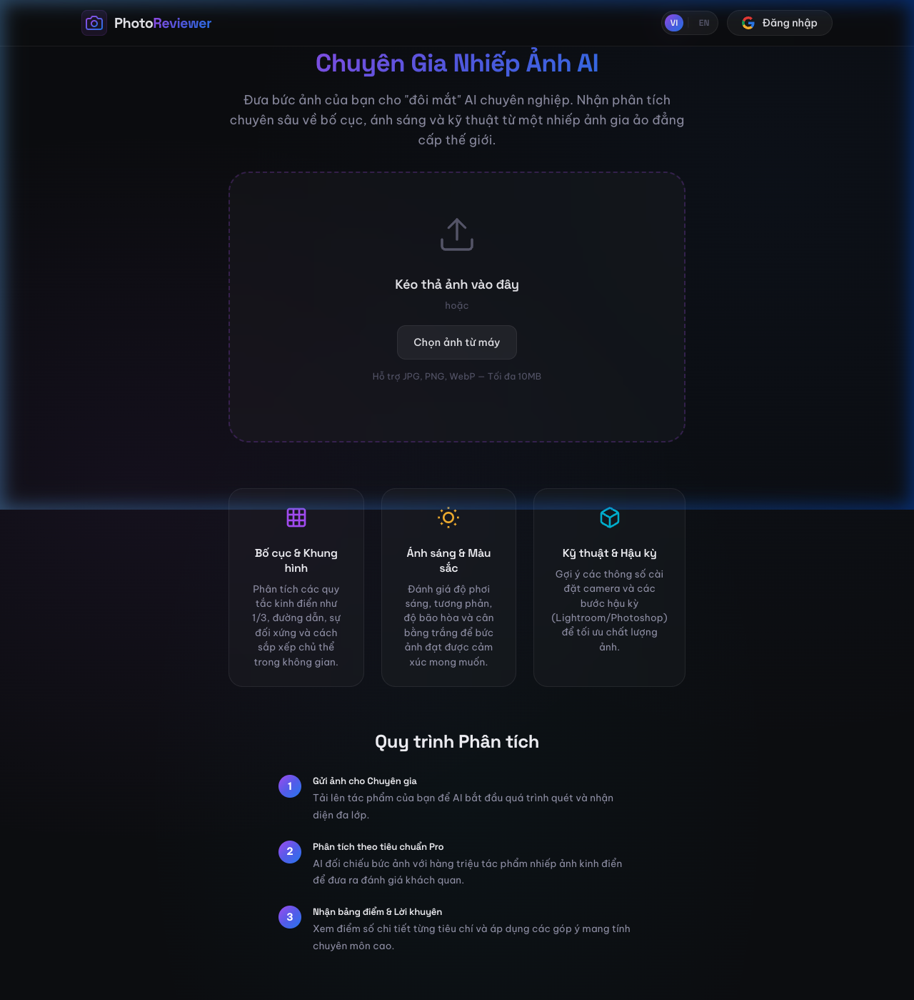
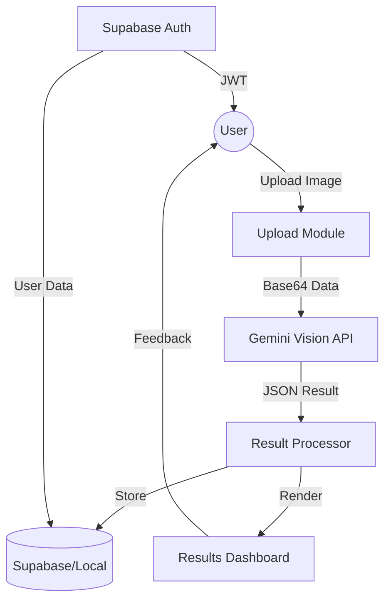

# PhotoReviewer AI 📸✨

**PhotoReviewer AI** is a premium, AI-powered web application designed to help photographers (and hobbyists) improve their work. It uses the **Google Gemini 2.0 Flash** vision model to provide expert-level analysis of composition, lighting, technical execution, and emotional impact.



## 🚀 Key Features

- **Expert AI Analysis**: Detailed feedback on 6 core photography criteria (Composition, Lighting, Color, Sharpness, Emotion, Technical).
- **Glassmorphism UI**: A stunning, modern dark-mode interface with smooth animations and responsive design.
- **Bilingual Support**: Full support for Vietnamese (Tiếng Việt) and English, with persistent preference storage.
- **Cloud Persistence**: Integrated with Supabase for Google Authentication and cross-device history sync.
- **Privacy First**: Choose between Guest mode (local storage) or Secure Cloud mode (Supabase).
- **Premium Assets**: Custom SVG branding and high-fidelity image processing.

## 🛠 Tech Stack

- **Frontend**: Vanilla JS (ESNext), HTML5, CSS3 (Glassmorphism design system).
- **Core Engine**: Vite (Build tool).
- **AI Backend**: Google Gemini AI (Vision API).
- **Database & Auth**: Supabase (PostgreSQL & GoTrue).
- **Hosting Compatibility**: Vercel, Netlify, or any static hosting provider.

## 🏗 Architecture



## ⚙️ Prerequisites

1.  **Node.js** (v18+)
2.  **Google Gemini API Key**: Obtain from [Google AI Studio](https://aistudio.google.com/).
3.  **Supabase Project**: Create a project at [supabase.com](https://supabase.com/).

## 🚦 Getting Started

1.  **Clone the repository**:

    ```bash
    git clone https://github.com/yourusername/photo-reviewer.git
    cd photo-reviewer
    ```

2.  **Install dependencies**:

    ```bash
    npm install
    ```

3.  **Configure Environment**:
    Create or update `src/supabase.js` with your Supabase credentials.

4.  **Run Dev Server**:
    ```bash
    npm run dev
    ```

## 📂 Project Structure

| File/Folder     | Description                                     |
| :-------------- | :---------------------------------------------- |
| `src/main.js`   | App entry point and UI orchestration.           |
| `src/api.js`    | Gemini API integration and database sync logic. |
| `src/auth.js`   | Supabase authentication handlers.               |
| `src/i18n.js`   | Internationalization (VI/EN) dictionaries.      |
| `src/style.css` | Global design system and responsive styles.     |
| `index.html`    | Core application structure.                     |

## 📜 License

This project is licensed under the MIT License.
